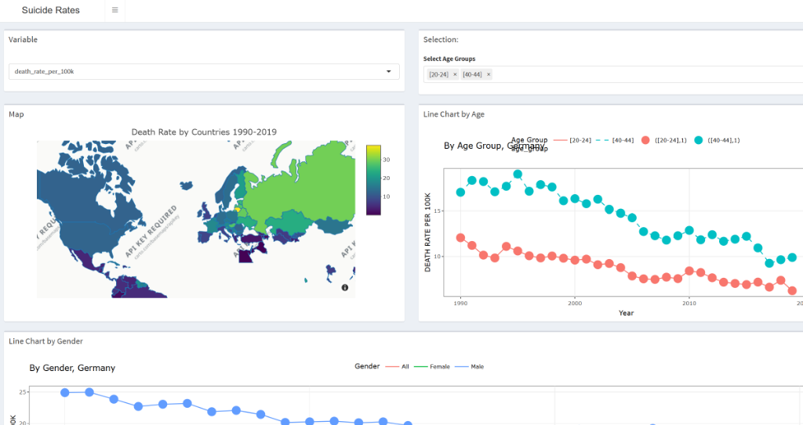
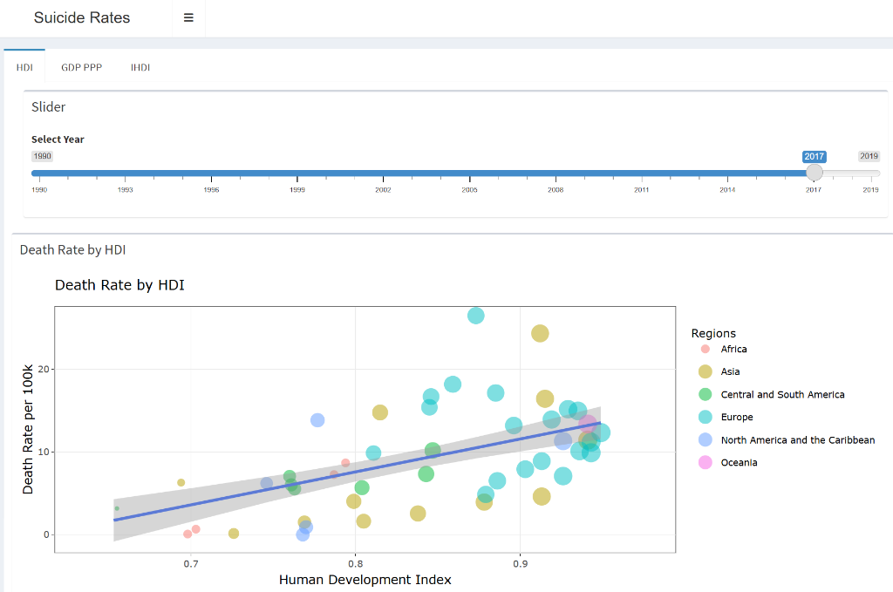
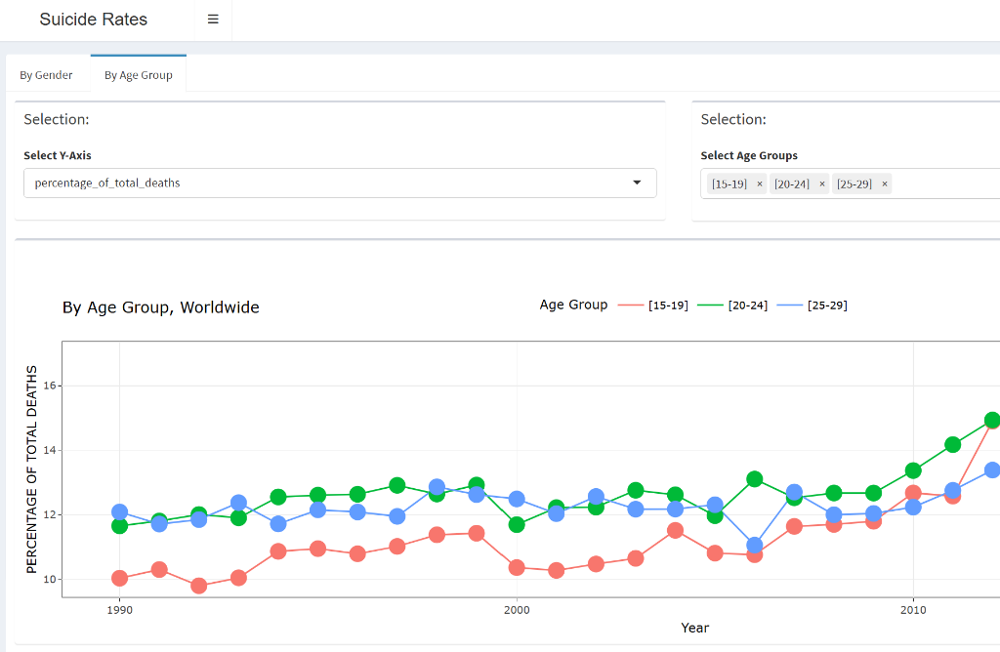

# Global Socioeconomic and Public Health Analysis

This project explores a complex and critical public health issue by analyzing the relationship between socioeconomic indicators (like the Human Development Index and GDP) and specific critical mortality rates on a global scale. It features an interactive web application built with R and Shiny.

## 🎯 Project Goal
The primary objective of this project was to tackle a truly important and challenging societal issue, rather than just analyzing a standard dataset. 

**Key Finding:** The visualization reveals a counterintuitive but significant trend: *regions with higher living standards (higher HDI and GDP PPP) often correlate with higher rates of this specific critical mortality metric*. This highlights the complexity of mental well-being and public health, proving that economic prosperity alone does not guarantee a decline in all public health crises.

## 📸 Dashboard Previews

### Interactive Choropleth Map & Age Group Trends
The map allows users to visually explore geographical distributions of the mortality metric, while the line charts break down the data by age demographics over time.


### Socioeconomic Correlation (HDI Scatter Plot)
A scatter plot correlating the Human Development Index (HDI) with the mortality rate per 100k people. The regression line clearly illustrates the trend across different global regions.


### Time Series Analysis
Line charts showing the percentage of total deaths distributed across different age groups globally from 1990 to 2019.


## 🛠️ Features
- **Interactive Dashboards**: Visualizes death rates globally and per country based on HDI and GDP (Purchasing Power Parity).
- **Choropleth Maps**: Displays geographical metric rates by country over time.
- **Trend Analysis**: Line charts detailing rates segmented by age group and gender.
- **Data Tables**: Allows for in-depth data querying and filtering.

## 🚀 Prerequisites
To run this project locally, you will need:
- [R](https://cran.r-project.org/)
- [RStudio](https://posit.co/download/rstudio-desktop/) (Recommended)

### Required R Packages
Before running the app, ensure you have installed all the necessary dependencies. You can install them by running the following command in your R console:

```R
install.packages(c("shiny", "shinydashboard", "plotly", "tidyverse", "DT", "ggthemes", "tidyr", "rjson", "reshape2", "dplyr"))
```

## 🖥️ How to Run
1. Open the project folder (`Assignment_3`) in RStudio, or open one of the script files (`ui.r`, `server.r`, or `global.r`).
2. RStudio will automatically recognize this as a Shiny application.
3. Click the **"Run App"** button at the top right of the source editor.
4. Alternatively, you can run the app directly from the R console:
```R
shiny::runApp()
```

## 📁 Project Structure
- `ui.r` - The user interface configuration of the Shiny app.
- `server.r` - The server-side logic and chart rendering.
- `global.r` - Data preparation, loading, and cleaning steps that run before the app starts.
- `assets/` - Screenshots and images used in the documentation.
- `*.csv` and `*.json` - The dataset files containing WHO mortality data, HDI, GDP, and map coordinates.

## 📌 Background
This project was initially completed as a university assignment in Data Visualization, with the intent of shedding light on an uncomfortable but vital global issue.
